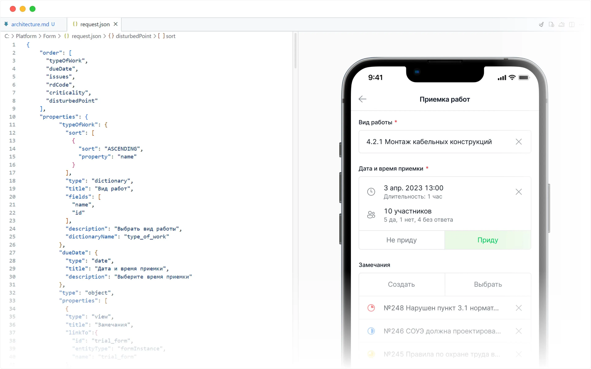

# МРС Платформа — Low-code платформа для быстрой разработки продуктов

## Контекст системы

Крупная платформа, позволяющая разрабатывать продукты любой сложности
в короткие сроки. Позиционируется как low-code решение для бизнес-приложений.
Продуктами платформы пользуются 30–60 компаний-клиентов — в основном
строительные, включая крупных игроков рынка (Полюс, Мосинжпроект).

Стек: Java, Hibernate, Maven, Kotlin (Ktor, JetBrains Exposed),
PostgreSQL, React, React Native, Jenkins.

## Роль

Техлид. Участие в проектировании архитектуры платформы,
разработка ключевых сервисов и подсистем.
Полная ответственность за качество кода и работоспособность системы.

**Возглавлял R&D-направление** — исследование и внедрение
новых технологий и подходов в платформу.

## Ключевые задачи

- Проектирование архитектуры платформы
- Разработка ключевых сервисов и подсистем
- Технические решения по стеку и подходам
- Полная ответственность за качество кода и работоспособность системы
- Руководство R&D-направлением

## R&D: что внедрил

### Kotlin и Kotlin Multiplatform

Инициировал и реализовал переход команды на Kotlin,
в том числе Kotlin Multiplatform (KMP).

Это открыло ряд нетривиальных возможностей:
- **shared-kernel** — мультитенантная инфраструктура в общей библиотеке:
  получение данных тенанта, соединения к БД, RabbitMQ, Kafka, S3, авторизация.
  Относительно бизнес-логики это в среднем 20–30% объёма кода
- **common-core** — весь бизнес-слой в общей библиотеке JVM/JS: верификация,
  бизнес-функции, репозитории, DTO. В результате клиентские приложения
  отвечают только за UI, а бэкенд — за соединение shared-kernel
  с common-core и небольшую специфичную логику
- **Плагины для текстовых редакторов и IDE** для работы
  с конфигурациями платформы — улучшили DX разработчиков
- Сервисы и утилиты на единой кодовой базе

### Выбор Ktor + Exposed для новых сервисов

Новые сервисы платформы разрабатывались на Kotlin + Ktor + Exposed —
в противовес существующей части стека на Spring Boot + Hibernate.

Обоснование выбора (по замерам на сервисах платформы):
- **Время запуска** — Ktor-сервис стартует за 3–5 секунд против 25–30 секунд
  у Spring Boot, что критично при горизонтальном масштабировании и перезапусках
- **Потребление памяти** — ~130 МБ против ~225 МБ у Spring-контейнера
- **Exposed vs Hibernate** — DSL поверх JDBC без ORM-магии, предсказуемые SQL-запросы,
  полный контроль над тем что уходит в базу

### RealmDB → SQLite на мобильных клиентах

Инициировал замену RealmDB на SQLite на мобильных клиентах платформы.

Мотивация: унификация SQL между бэкендом и мобильными клиентами,
устранение зависимости от проприетарного решения.

### Переход на GitHub

Участвовал в миграции на GitHub с их инфраструктурой:
Actions, Packages, управление кодом.

### QUIC / HTTP/3

Внедрение QUIC-протокола в платформу — продолжение исследования,
начатого ещё в GXB Ventures. К моменту внедрения в МРС протокол
уже был стандартизирован как HTTP/3.

### Внедрение AI-инструментов в разработку

Исследовал и внедрил AI-инструменты для разработчиков.
Результат — повышение скорости и качества разработки в команде.

### Исследование технологий

Систематическое исследование технологий по двум осям:
- улучшение качества продукта
- улучшение качества работы разработчиков (DX)

## Что было интересно

Low-code платформа — система, которая строит другие системы.
Архитектурные решения здесь имеют мультипликативный эффект:
ошибка в ядре проявляется во всех продуктах на платформе.

R&D в таком контексте — это не эксперименты ради экспериментов,
а поиск решений, которые улучшают всю экосистему разом.
