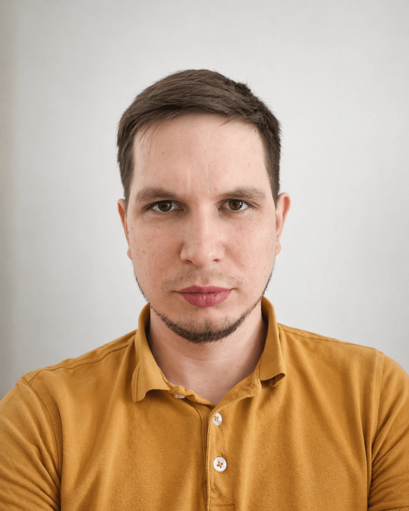

# Сергей Князев — Технический лидер / Архитектор

## Кратко

Technical Lead / Архитектор с 9+ годами коммерческой разработки. 7 лет в роли технического лидера — проектирую распределённые backend-системы и B2B SaaS платформы, руковожу командами 7–13 человек.
Основной стек: JVM (Kotlin, Java), Spring Boot, Ktor, Exposed, PostgreSQL. Интеграция AI в рабочий процесс.
Фокус: архитектура, R&D, миграции без даунтайма, масштабирование продуктов из MVP.

Автор [Kormium](https://github.com/kormium/kormium) — open-source ORM для Kotlin Multiplatform (Maven Central, Apache 2.0): дизайн публичного API, PostgreSQL на Kotlin/Native через libpq. Глубокое понимание внутреннего устройства БД, транзакций и многопоточности.

## Профессиональный фокус

Backend: Java, Kotlin, SQL, REST API
Архитектура: микросервисы, API-дизайн, работа с данными
Практика: code review, прод-инциденты, интеграции
AI: prompting, orchestration, validation (Claude, Codex)
Инфраструктура: Docker, CI/CD

---

## Стиль работы

Innovator: ищу и внедряю новые подходы и технологии до того,
как они становятся очевидными.

Лучший результат — в роли, где есть реальное влияние на технические
и продуктовые решения. Не "винтик в машине", а человек,
с которым советуются перед принятием важных решений.

Работаю лучше всего в личном диалоге: идеи формируются
в разговоре, а не в презентациях.

---

## Что ищу

Technical Lead · Architect · Principal Engineer.
Backend или платформенные команды.
Удалёнка или гибрид.

---

## Условия и доступность

- **Notice period**: готов выйти сразу, без отработки.
- **Почему рассматриваю новые предложения**: рост текущей компании
  остановился — ищу новые возможности для развития.
- **Английский**: B1–B2 (рабочий уровень для переписки и чтения
  технической документации).
- **Гражданство**: Россия.
- **Часовой пояс**: Москва (UTC+3).
- **Компенсация**: обсуждается при контакте — готов к разговору
  под конкретную роль и объём ответственности.

---

## Почему этот сайт существует

Большая часть предыдущего опыта защищена NDA.
Публично верифицировать можно два артефакта: [Kormium](https://github.com/kormium/kormium) —
мою ORM для Kotlin Multiplatform — и этот сайт:
открытый репозиторий, задокументированные решения, работающая система.

Сайт спроектирован так же, как я проектирую рабочие системы.
